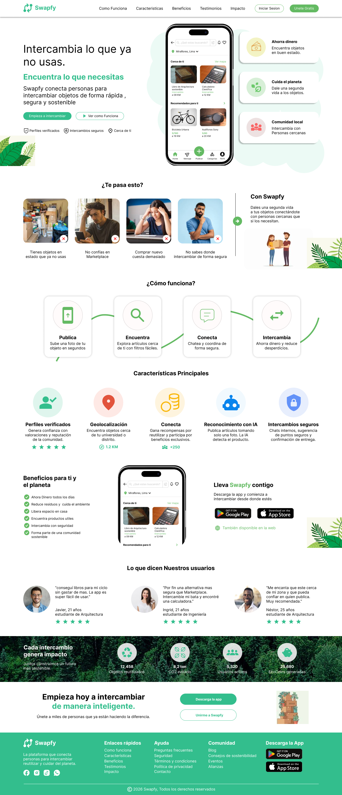

# Swapfy
Swapfy 🌱♻️

Swapfy es una plataforma web enfocada en el intercambio de objetos entre personas de forma segura, rápida y sostenible.
El objetivo del proyecto es promover la reutilización de productos, reducir residuos y conectar comunidades mediante una experiencia moderna e intuitiva.
------------------------------------------------------------------------------------------

🚀 Características principales: 
🔒 Perfiles verificados 
📍 Geolocalización de objetos cercanos 
🤖 Reconocimiento de artículos con IA 
💬 Chats e intercambios seguros 
🪙 Sistema de EcoCoins y recompensas 
📱 Diseño responsive para móviles y tablets
------------------------------------------------------------------------------------------

🖼️ Vista previa

  

------------------------------------------------------------------------------------------

🛠️ Tecnologías utilizadas: 
HTML5 
CSS3 
JavaScript 
Responsive Design 
Flexbox & Grid
------------------------------------------------------------------------------------------

🎯 Objetivo del proyecto

Crear una experiencia digital moderna que incentive la economía circular y facilite el intercambio de objetos entre estudiantes y comunidades locales.
------------------------------------------------------------------------------------------

🌍 Responsive Design 
El proyecto está optimizado para: 
💻 Desktop 
📱 Mobile 
📲 Tablet 
------------------------------------------------------------------------------------------

📄 Licencia 

Este proyecto es de uso educativo y académico.
